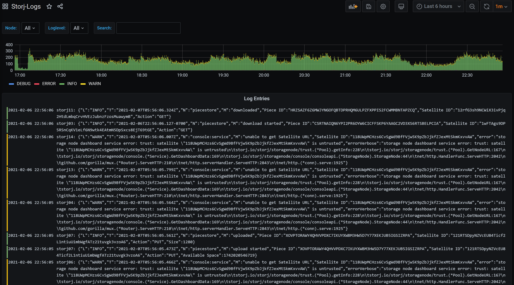
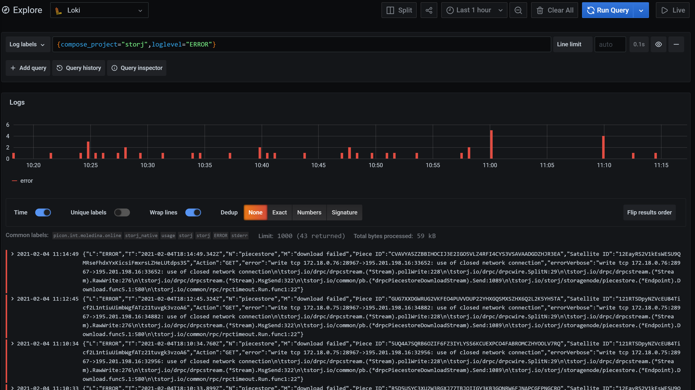

# Storj Dashboard combining Grafana Loki logs with Storj-Exporter

This config repo builds on the excellent work done at [kevinkk525/storj-log-exporter](https://github.com/kevinkk525/storj-log-exporter) and proposes and alternative method using Grafana Loki and Promtail for ingesting Storj node logs and producing Prometheus metrics.

The combined dashboard leverages [anclrii/Storj-Exporter](https://github.com/anclrii/Storj-Exporter) as well to provide a single view of key performance metrics for Storj nodes as well as the actual log entries for error and fatal logs.

Storj-Exporter-Logs dashboard:


Storj-Logs dashboard:



## Motivation

I've been interested in exploring [Grafana Loki](https://grafana.com/oss/loki/) with [Promtail](https://grafana.com/docs/loki/latest/clients/promtail/) for log ingestion and metrics for a number of different services on my home server. Testing it out for Storj nodes seemed like a great way to get an understanding of how it works.

For Storj nodes, the main benefit is that a single Promtail listener can injest logs from multiple nodes and produce metrics that Prometheus can then scrape. Individual storj-log-exporter instances are not required.

Furthermore, once the logs are ultimately shipped to Loki, one can do LogQL queries against them in Grafana or using [LogCLI](https://grafana.com/docs/loki/latest/getting-started/logcli/). For example, to search for all `ERROR` log level entries:



## Installation
### Edit Storj Node Logging Parameters

**Note: This dashboard requires the `json` log output from the storagenode service rather than the familiar console output. The log output looks different than the typical `console` output. However, common tools such as [successrate.sh](https://github.com/ReneSmeekes/storj_success_rate) appear to be able parse JSON log files without issue.**

An example log line item in JSON format is as follows:

```json
{"L":"INFO","T":"2021-02-04T15:47:50.240Z","N":"piecestore","M":"download started","Piece ID":"H5MHLOAWQBOZKVABCF5SXROFFON2HSKZNSMFJSICIRDEFNRKZVBA","Satellite ID":"1wFTAgs9DP5RSnCqKV1eLf6N9wtk4EAtmN5DpSxcs8EjT69tGE","Action":"GET"}
```

Also, the Promtail configuration in this repo requires the Storj logs to be exported to a log file. An alternative Promtail configuration that uses the Loki Docker driver to ship logs directly is included in my full Storj docker-compose stack repo at [fmoledina/docker-storj-config](https://github.com/fmoledina/docker-storj-config).

To set the log output to JSON encoding and to specify a log file, proceed with the following steps:
1. Stop the storagenode.
2. Edit the node `config.yaml` and set the following `log.encoding` and `log.output` parameters:

```bash
# configures log encoding. can either be 'console', 'json', or 'pretty'.
log.encoding: "json"
```

```bash
# can be stdout, stderr, or a filename
log.output: /mnt/storj/log/storj01.log
```

Ensure that the log file location is bind mounted in the Storj docker container.

### Configure Promtail

Edit `./appconfig/promtail/config.yml` for `nodename` and `__path__` values, where `__path__` is the log file configured in the Storj node `config.yaml`.

```yaml
#### Edit the node labels below to suit your configuration #####

## Storj node logging to Loki + Prometheus metrics generation
## Requires log.encoding="json"
## Ensure nodename is the same as in Prometheus config for Storj-Exporter
- job_name: storj
  static_configs:
  - targets:
      - localhost
    labels:
      job: storj
      nodename: storj01   # Same as prometheus config
      __path__: /mnt/storj/log/storj01.log
  # - targets:
  #     - localhost
  #   labels:
  #     job: storj
  #     nodename: storj02
  #     __path__: /mnt/storj/log/storj02.log
```

### Configure Prometheus

Edit your Prometheus config to adjust Storj-Exporter and add Promtail scrape configs. Note that the label used is `nodename` rather than `instance` as in Storj-Exporter and storj-log-exporter instructions. This is to align with the corresponding `nodename` variable provided by Promtail for Storj node log files.

Add `nodename` to your existing job for each node:
```yaml
  - job_name: 'storj-exporter'
    static_configs:
      ...
      - targets: ["storj01-exporter:9651"]  # adjust for your Storj-Exporter installation
        labels:
          nodename: "storj01"   # Same as promtail config
          instance: "storj01"   # Allows compatibility with Storj-Exporter-Dashboard
      # - targets: ["storj02-exporter:9651"]
      #   labels:
      #     nodename: "storj02"
      ...
```

Also add the Promtail metrics endpoint, where all the log metrics will be scraped from:

```yaml
  - job_name: 'promtail'
    static_configs:
      - targets: ['promtail:9080']  # adjust for your docker configuration (i.e. localhost:9080 if forwarding ports)
```

### Start Loki and Promtail

Start the service with the following `docker run` commands:

```shell
docker run -d --name promtail -p 9080:9080 -v /mnt/storj/logs:/mnt/storj/logs -v ./appconfig/promtail:/config -v /path/to/appdata/promtail:/data grafana/promtail:2.1.0 -config.file=/config/config.yml
docker run -d --name loki -p 3100:3100 -v ./appconfig/loki:/config -v /path/to/appdata/loki:/data grafana/loki:2.1.0 -config.file=/config/local-config.yaml
```

Alternatively, use the [quick-start guide](https://github.com/anclrii/Storj-Exporter-dashboard/tree/master/quick_start) available at the [Storj-Exporter-dashboard](https://github.com/anclrii/Storj-Exporter-dashboard) repo and add the services from the [docker-compose.yml](./docker-compose.yml) in this repo.

Start all the services in the combined `docker-compose.yml`:

```shell
docker-compose up -d
```

### Add dashboard to Grafana

Add the dashboard from the files [dashboard-exporter-logs.json](./dashboard-exporter-logs.json) and [dashboard-logs.json](./dashboard-logs.json) in the same way as described in KevinK's [How-To monitor all nodes in your lan](https://forum.storj.io/t/how-to-monitor-all-nodes-in-your-lan-using-prometheus-grafana-linux-using-docker). You'll need to create the connection to the Loki datasource in Grafana and select that datasource along with Prometheus when loading these dashboards.

## Notes

The [Notes section from Storj-Log-Exporter](https://github.com/kevinkk525/storj-log-exporter#notes) are valid for the Promtail log metrics methodology presented in this repo.

## Logging Limits

- Loki has been configured with a 30 day log retention time. Adjust `retention_period` under `table_manager` in `./appconfig/loki/local-config.yaml` if a different retention time is desired.

## TODO

- Optional drop all logs except loglevel ERROR or FATAL (i.e. drop INFO, WARN, DEBUG)